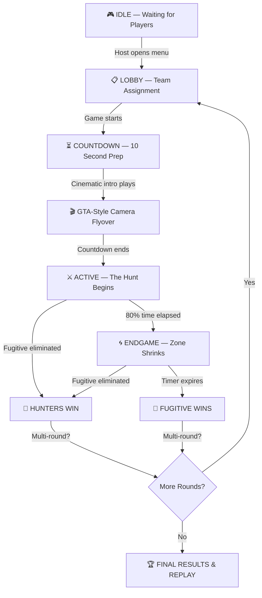

<div align="center">

<!-- Header Banner -->


# 🎯 MANHUNT V3

### *The Ultimate Cat & Mouse Survival Experience*

<br/>


<br/>

[](https://steamcommunity.com/sharedfiles/filedetails/?id=3678539365)
[](https://github.com/p-astro16/GManhuntV2)

<br/>

> **One fugitive. Multiple hunters. 30 minutes to survive.**
> Airstrikes, drones, car bombs, scanners — and a shrinking zone closing in.**
> Can you escape?

<br/>

---

</div>

## 🕹️ What is Manhunt?

**Manhunt** is a high-stakes survival gamemode for Garry's Mod inspired by GTA Online's manhunt and battle royale mechanics. One player becomes the **Fugitive** and must survive against a team of **Hunters** armed with powerful surveillance and tactical equipment.

Choose between two intense game modes:

| | 🏃 **Classic Mode** | 🏎️ **High-Speed Chase** |
|---|---|---|
| **Style** | On-foot survival | Vehicle-based pursuit |
| **Pace** | Strategic, stealth-focused | Fast, action-packed |
| **Abilities** | Decoys, car bombs, scanners | Oil slicks, EMP, nitro, missiles |
| **Duration** | Up to 30 min | 10 min |

---

## ✨ Features

<div align="center">

```
  ╔══════════════════════════════════════════════════════════════════╗
  ║                    🎮 CORE GAMEPLAY                             ║
  ╠══════════════════════════════════════════════════════════════════╣
  ║  👤 Fugitive vs 🔴 Hunters — Asymmetric team-based survival    ║
  ║  🏃 Classic Mode — On-foot stealth and survival                ║
  ║  🏎️ High-Speed Chase — Vehicle combat with 12 unique abilities ║
  ║  🔄 Multi-Round System — Up to 10 rounds with rotating roles   ║
  ║  📊 Score Tracking — Full match statistics and leaderboards     ║
  ╚══════════════════════════════════════════════════════════════════╝
```

</div>

### 🔫 Arsenal & Equipment

<table>
<tr>
<td width="50%">

#### 👤 Fugitive Loadout
| Item | Description |
|:---:|---|
| 💨 | **Smoke Grenade** — Concealment cover |
| 💥 | **Flash Grenade** — Blind your pursuers |
| 🏥 | **Medkit** — Heal on the run |
| 📡 | **Scanner** — Locate hunter positions |
| 💣 | **Car Bomb** — Booby-trap vehicles |
| 🚗 | **Vehicle Beacon** — Spawn escape car |
| 👻 | **Decoy** — Fake scanner blip |
| 🔫 | **USP Pistol** — Last resort (at 50% time) |

</td>
<td width="50%">

#### 🔴 Hunter Loadout
| Item | Description |
|:---:|---|
| 📡 | **Scanner** ×5 — Track the fugitive |
| 🎯 | **Airstrike** — Massive area bombardment |
| 🕹️ | **Recon Drone** — Aerial surveillance |
| 💣 | **Car Bomb** — Trap vehicles |
| 🚗 | **Vehicle Beacon** — Spawn pursuit vehicles |

</td>
</tr>
</table>

### 🏎️ Chase Mode Abilities

<table>
<tr>
<td align="center" width="16%">

**🛢️ Oil Slick**
<br/><sub>Drop oil behind,<br/>cause spin-outs</sub>

</td>
<td align="center" width="16%">

**💨 Smoke Screen**
<br/><sub>Deploy thick<br/>smoke clouds</sub>

</td>
<td align="center" width="16%">

**⚡ EMP Blast**
<br/><sub>Disable nearby<br/>hunters for 3s</sub>

</td>
<td align="center" width="16%">

**🚀 Nitro Boost**
<br/><sub>Massive speed<br/>burst for 3s</sub>

</td>
<td align="center" width="16%">

**🛡️ Shield**
<br/><sub>4 seconds of<br/>invulnerability</sub>

</td>
<td align="center" width="16%">

**👻 Ghost Mode**
<br/><sub>Go invisible &<br/>phase through</sub>

</td>
</tr>
<tr>
<td align="center">

**💫 Shockwave**
<br/><sub>Push vehicles<br/>away from you</sub>

</td>
<td align="center">

**🚧 Roadblock**
<br/><sub>Spawn barriers<br/>on the road</sub>

</td>
<td align="center">

**🚀 Missile**
<br/><sub>Homing projectile<br/>150 damage</sub>

</td>
<td align="center">

**📍 Tracker Dart**
<br/><sub>Tag fugitive,<br/>reveal 15s</sub>

</td>
<td align="center">

**🔧 Repair Kit**
<br/><sub>Restore vehicle<br/>health</sub>

</td>
<td align="center">

**⏱️ Speed Trap**
<br/><sub>Slow down<br/>enemies</sub>

</td>
</tr>
</table>

---

### 🎬 Cinematic Experience

| Feature | Description |
|:---|:---|
| 🎥 **GTA-Style Intro** | Dramatic camera sweep across the map before the hunt begins |
| 📹 **Killcam** | Smooth replay of the killing blow with Catmull-Rom interpolation |
| 🗺️ **Post-Game Replay** | Top-down animated path replay showing the entire match |
| 🎯 **Surveillance Camera** | Real-time GTA V-style camera feed when scanning |
| 🌐 **3D Ping System** | Animated world markers with off-screen directional arrows |

### 🛡️ Dynamic Zone System

<div align="center">

```
  ┌─────────────────────────────────────────────┐
  │              FULL MAP AREA                   │
  │    ┌───────────────────────────────────┐     │
  │    │         ZONE SHRINKING...         │     │
  │    │    ┌─────────────────────────┐    │     │
  │    │    │                         │    │     │
  │    │    │    ┌───────────────┐    │    │     │
  │    │    │    │  SAFE ZONE 🟢 │    │    │     │
  │    │    │    └───────────────┘    │    │     │
  │    │    │                         │    │     │
  │    │    └─────────────────────────┘    │     │
  │    └───────────────────────────────────┘     │
  │  ☠️ DAMAGE ZONE — 5-20 HP/s                  │
  └─────────────────────────────────────────────┘
```

</div>

- 🔴 Activates during the last **20%** of game time
- ⏰ **15-second** grace period before shrinking begins
- 🧭 Compass indicator shows safe zone direction
- 💀 Escalating damage for staying outside the zone

---

## ⚙️ Configuration

All settings are configurable via the in-game menu (`!manhunt` or `manhunt_menu`):

| Setting | Range | Default | Description |
|---|---|---|---|
| 🕐 **Game Time** | 1 — 120 min | 30 min | Total match duration |
| 📡 **Scan Interval** | 0.5 — 10 min | 3 min | Time between automatic scans |
| 🔄 **Rounds** | 1 — 10 | 1 | Rounds per match (rotating fugitive) |
| 📚 **Tutorial** | On / Off | On | Interactive tutorial for new players |
| 🌀 **Zone** | On / Off | On | Endgame shrinking zone |
| 🎮 **Game Mode** | Classic / Chase | Classic | On-foot vs. vehicle pursuit |

---

## 📦 Installation

### Requirements

| Dependency | Required | Description |
|---|:---:|---|
| [Garry's Mod](https://store.steampowered.com/app/4000/Garrys_Mod/) | ✅ | Base game |
| [Glide](https://steamcommunity.com/workshop/browse/?appid=4000&searchtext=glide) | ⚠️ Recommended | GTA-style vehicles (falls back to simfphys) |

### Quick Start

1. **Subscribe** to the [Steam Workshop addon](https://steamcommunity.com/sharedfiles/filedetails/?id=3678539365)
2. **Start** a Garry's Mod server (Sandbox or dedicated)
3. **Open** the Manhunt menu with `!manhunt` in chat or `manhunt_menu` in console
4. **Assign teams** — pick a Fugitive and Hunters
5. **Configure** settings to your liking
6. **Start the game** and let the hunt begin! 🎯

### Manual Installation

```bash
# Clone the repository into your addons folder
cd garrysmod/addons
git clone https://github.com/p-astro16/GManhuntV2.git manhunt
```

---

## 🗂️ Project Structure

```
manhunt/
├── 📄 addon.json               # Addon metadata
├── lua/
│   ├── autorun/
│   │   └── 🔄 manhunt_init.lua # Auto-loader (sv/cl/sh routing)
│   ├── manhunt/
│   │   ├── 📋 sh_config.lua        # Shared config & net strings
│   │   ├── 📋 sh_chase_config.lua  # Chase mode config & abilities
│   │   ├── 📋 sh_gamestate.lua     # Game phase definitions
│   │   │
│   │   ├── 🖥️ sv_game.lua          # Core game loop & phases
│   │   ├── 🖥️ sv_teams.lua         # Team assignment & management
│   │   ├── 🖥️ sv_rounds.lua        # Multi-round system
│   │   ├── 🖥️ sv_inventory.lua     # Loadout distribution
│   │   ├── 🖥️ sv_chase.lua         # Chase mode server logic
│   │   ├── 🖥️ sv_pickups.lua       # Item spawns (classic)
│   │   ├── 🖥️ sv_chase_pickups.lua # Ability pickups (chase)
│   │   ├── 🖥️ sv_tracking.lua      # Position & stats recording
│   │   ├── 🖥️ sv_vehicles.lua      # Vehicle spawning & management
│   │   ├── 🖥️ sv_zone.lua          # Shrinking zone logic
│   │   ├── 🖥️ sv_tutorial.lua      # Interactive tutorial
│   │   │
│   │   ├── 🎨 cl_hud.lua           # Heads-up display
│   │   ├── 🎨 cl_menu.lua          # Host configuration menu
│   │   ├── 🎨 cl_lobby.lua         # Pre-game lobby overlay
│   │   ├── 🎨 cl_camera.lua        # Surveillance camera feed
│   │   ├── 🎨 cl_killcam.lua       # Death replay camera
│   │   ├── 🎨 cl_replay.lua        # Post-game path replay
│   │   ├── 🎨 cl_cinematic.lua     # GTA-style intro flyover
│   │   ├── 🎨 cl_ping.lua          # 3D world ping markers
│   │   ├── 🎨 cl_chase.lua         # Chase mode client effects
│   │   ├── 🎨 cl_drone.lua         # Drone camera view
│   │   ├── 🎨 cl_decoy.lua         # Decoy visual effects
│   │   ├── 🎨 cl_pickups.lua       # Pickup UI indicators
│   │   ├── 🎨 cl_rounds.lua        # Round info & scoreboards
│   │   ├── 🎨 cl_endgame.lua       # End-of-game screens
│   │   ├── 🎨 cl_zone.lua          # Zone visual rendering
│   │   ├── 🎨 cl_vbeacon.lua       # Vehicle beacon effects
│   │   └── 🎨 cl_tutorial.lua      # Tutorial UI steps
│   │
│   └── weapons/
│       ├── 💣 weapon_manhunt_airstrike/
│       ├── 💣 weapon_manhunt_carbomb/
│       ├── 💣 weapon_manhunt_decoy/
│       ├── 💣 weapon_manhunt_drone/
│       ├── 💣 weapon_manhunt_scanner/
│       └── 💣 weapon_manhunt_vbeacon/
```

---

## 🎮 Game Flow



---

## 📸 Screenshots

> *Screenshots coming soon — subscribe on the [Steam Workshop](https://steamcommunity.com/sharedfiles/filedetails/?id=3678539365) to see the addon in action!*

---

## 🤝 Contributing

Contributions, bug reports, and feature requests are welcome!

1. **Fork** the repository
2. **Create** a feature branch (`git checkout -b feature/amazing-feature`)
3. **Commit** your changes (`git commit -m 'Add amazing feature'`)
4. **Push** to the branch (`git push origin feature/amazing-feature`)
5. **Open** a Pull Request

---

<div align="center">

---

### ⭐ If you enjoy Manhunt, give it a star on GitHub!

[](https://github.com/p-astro16/GManhuntV2)
[](https://steamcommunity.com/sharedfiles/filedetails/?id=3678539365)

<br/>

<sub>Made with ❤️ for the Garry's Mod community</sub>


</div>
